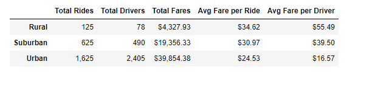
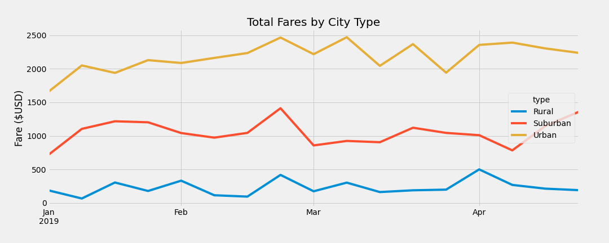

# PyBer_Analysis
The purpose of the  analysis is to search through ride sharing data and determine key metrics that will allow V. Isualize to compare rural, suburban, and urban cities' rides. This included total rides, drivers, and fares, as well as average fares per ride and per driver. This data was organized to various tables.The data sets were also used to generate a new data frame that calculated the average weekly fare for each city type from January 1st, 2019 to April 29th, 2019.The analysis dataframe was used to generate a multiple-line graph that depicted the total weekly fares for each city type over the specified time period. 

## Results
# Ride Share by City Type
As per the data given below,Some observations are that,as cities became more urban several trends emerged: -Total rides, total fares, and total drivers all increased, and  due to the higher population -Average fare per ride and average fare per driver all decreased

# Total Fares by City Type
 As part of the analysis, the below  multiple line chart was created to help us visualize and analyze the Total Fares from January 1st, 2019 to April 29th, 2019 for each city type. In this period of analysis of the total fares for each city type, we can  see that the total fares for city types are the highest in all weeks for urban city types and the lowest in rural areas. You can also see that the third week of February is the highest total fare of any city type that is in increasing demand at that time.

## Summary

Consider increasing the fare in urban areas for more profit since almost 2/3 of rides are in urban areas.Suburban areas specifically see an upwards trend in revenues moving into May. It would be interesting for PyBer to do more analysis on the increase of revenues for Suburban areas during the month of April, as Urban areas show a decrease during the same period.